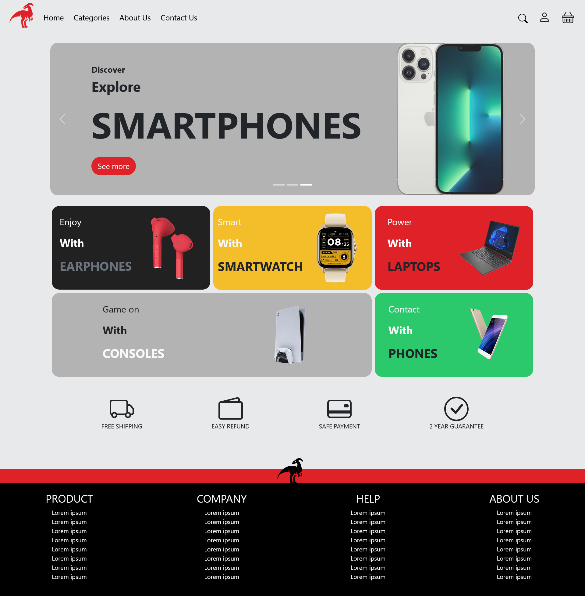
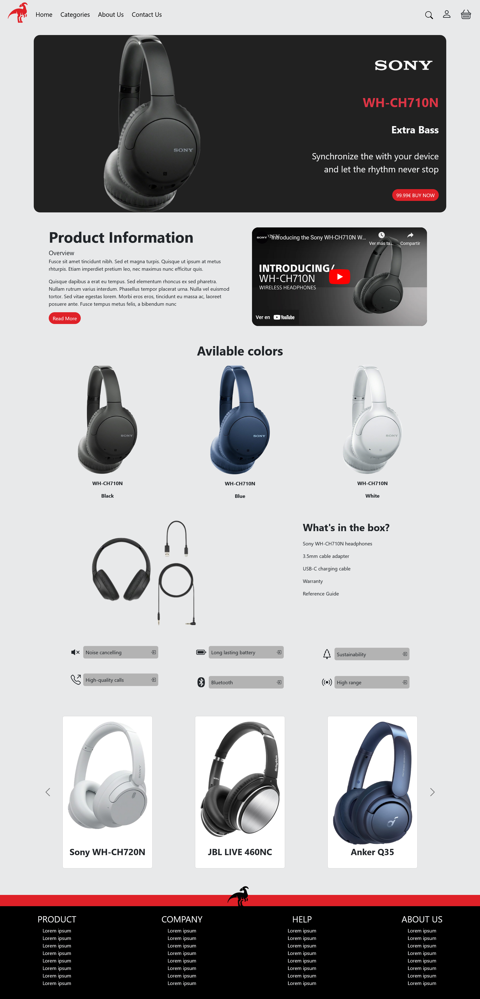

# 🦖 DinoTech - Simulación de Tienda de Tecnología

Bienvenido al repositorio de **DinoTech**, una web simulada que representa una tienda de tecnología. Este proyecto **frontend** simula las principales funcionalidades de una tienda en línea donde se pueden explorar productos tecnológicos, consultar detalles y visualizar un diseño optimizado tanto para escritorio como para dispositivos móviles. 

## 🚀 Descripción

El proyecto **DinoTech** simula la experiencia de usuario de una tienda de tecnología en línea. Está enfocado únicamente en el desarrollo frontend, implementando las siguientes características:

- **Página de inicio**: Vista de los productos destacados con accesos directos a los detalles de cada uno.
- **Página de productos**: Información detallada de los productos disponibles en la tienda.
- **Diseño responsive**: La página está optimizada para diferentes dispositivos, asegurando una experiencia fluida tanto en pantallas de escritorio como en móviles.

## 🎨 Tecnologías Utilizadas

- **HTML5**: Estructura y marcado de la página.
- **CSS3**: Estilos y diseño responsive.
- **Frameworks/Librerías**:
  - **Bootstrap**: Para facilitar la creación de un diseño responsive y componentes UI reutilizables.

## 📸 Vistas del Proyecto

A continuación se muestran capturas de las diferentes vistas de la página, tanto en escritorio como en dispositivos móviles.

### 🖥️ Vista en Escritorio

#### Pantalla de Inicio

#### Pantalla de Detalle del Producto

### 📱 Vista en Móvil

#### Pantalla de Inicio

#### Pantalla de Detalle del Producto

## 🌐 Funcionalidades Simuladas

- **Exploración de productos**: Los usuarios pueden ver los productos destacados y explorar más detalles.
- **Diseño responsive**: La web está diseñada para ajustarse de forma automática y eficiente tanto en pantallas de escritorio como en teléfonos móviles.
  
> **Nota:** Este proyecto es únicamente una simulación de frontend. No incluye ninguna funcionalidad de backend ni base de datos, y no está conectado a un sistema de compra real.
